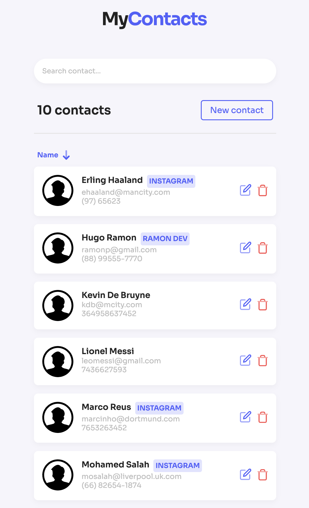

# My Contacts

This is My Contacts Project - A big project that was built using [React.js](https://reactjs.org/) with [Node.js](https://nodejs.org/), [Javascript](https://www.ecma-international.org/), it also uses [Styled Components](https://styled-components.com/) to make this application look very crisp and solid, [Docker](https://www.docker.com/) to manage the containers of the application where the Databases, [Postgres](https://www.postgresql.org/) to store the data of our contacts.

<p>&nbsp;</p>

<p align-items="center" justify-content="center">

</p>

<p>&nbsp;</p>

This is a preview of the application

<br/>



<br/>

# Installation

After downloading you should install the missing packages and dependencies

using NPM:

```sh
npm install
```
using Yarn
```sh
yarn add
```
using PNPM:

```sh
pnpm install
```

<br/>

# Run the project in development environment

using NPM:

```sh
npm run dev
```
using Yarn
```sh
yarn dev
```
using PNPM
```sh
pnpm run dev
```


# License
© Feito com muito &#10084; por [Hugo Ramon Pereira](https://www.linkedin.com/in/hugo-ramon-pereira/) 🇧🇷
